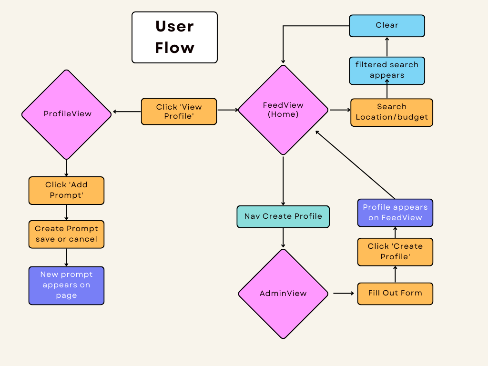
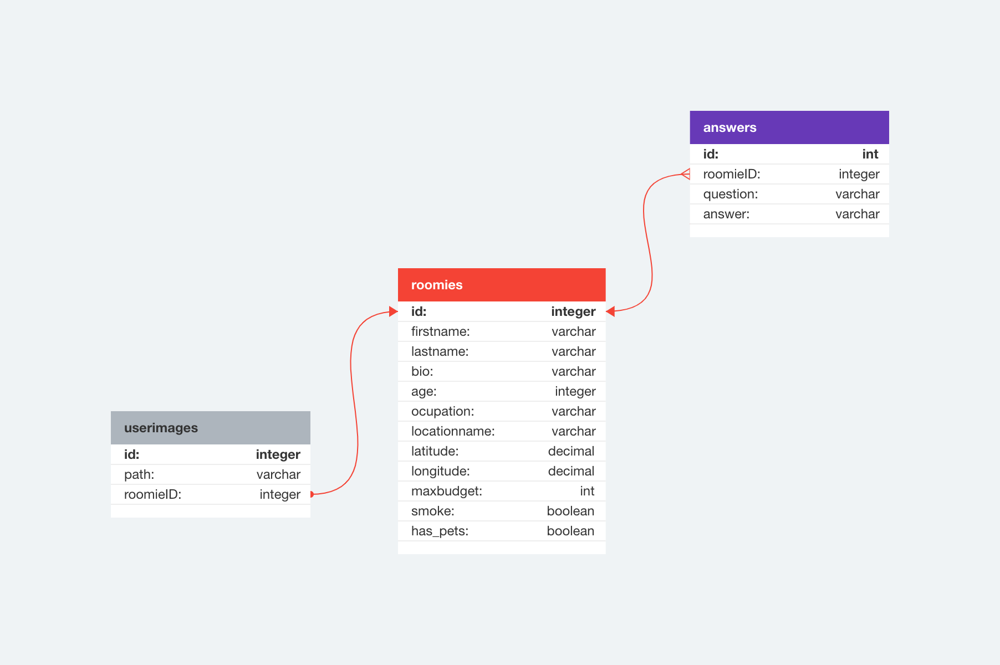

# HouseMate - An MVP by Veronica 

## Introduction 

Hello! Welcome to my project. 

A little overview of what this project is/what I would like it to be: 

HouseMate is a a platform for users to connect with potential roomates in in a given area. The main premise is that users can display their perosnailities on their profiles by responding to prompts. 

## SetUp

### Dependencies 

Run `npm install` in the project folder to install dependencies related to Express (the server).

`cd client` and run `npm install` install dependencies related to React (the client).

### Database Prep

Create `.env` file in project directory and add

```
DB_NAME=housemates
DB_PASS=YOUR_PASSWORD
```

(replace `YOUR_PASSWORD` with your actual password)


Type `mysql -u root -p` to access the MySQL CLI using your password.

In the MySQL CLI, type `create database housemates;` to create a database in MySQL.

Run the following in the MySQL CLI: `ALTER USER 'root'@'localhost' IDENTIFIED WITH mysql_native_password BY 'YOUR_PASSWORD';` (replace `YOUR_PASSWORD` with your actual password)

Run `npm run migrate` in your **TERMINAL**, in the **project** folder (not your MySQL CLI! Open a new terminal window for this). This will create three tables called 'roomies', 'answers' and 'userimages' in your database.

### Run Your Development Servers

- Run `npm start` in project directory to start the Express server on port 4001
- `cd client` and run `npm run dev` to start client server in development mode with hot reloading in port 5173.
- Client is configured so all API calls will be proxied to port 4000 for a smoother development experience. Yay!
- You can test your client app in `http://localhost:5173`
- You can test your API in `http://localhost:4001/api`

### Google Places API 

Head to the google maps platform and follow the instructions to generate a Maps API key.

Go to the index.html file. within the head section, you will find a script including the below. Put your API key in the designated section. 

`
  type="text/javascript"
  src="https://maps.googleapis.com/maps/api/js?key={YOUR-API-KEY}&libraries=places"`

Ensure you have no restrictions on your API key! You can check this in your google maps account. 

### UserFlow 

I have attempted to make a userflow diagram so you can understand how the website works a little bit 

see here: 


### Database Schema 

Here I have included a diagram of my database schema to visualise how all the information is linked!



# 'roomies' 
- The main table in the database
- A roomie is created by creating a profile in the front end. 
- All fields are filled in at the create profile page. Longitude and latitude come from the google places API which has a function that allows to obtain this information. 

# 'answers'
- answers is the table that contains each roomie's responses to the prompts at their profiles. 
- The roomieID column has a many-to-one relationship with the roomies table. The roomieID colum refers to the id column in roomies. All roomie rows also delete on cascade. Do not worry too much about this as it has been set up for you, but good to keep in mind. 

# 'userimages'
- The intention for this table is to store the image paths for when users upload their profile picture on their profile pages. 
- At the moment, I have commented out the code that involves this in the front-end to avoid confusion as it is in progress, but feel free to take a look and message me about it! 


I think that is everything you will need! As for endpoints, I have detailed them out in each of the route files. 

_This is a student project that was created at [CodeOp](http://CodeOp.tech), a full stack development bootcamp in Barcelona._
